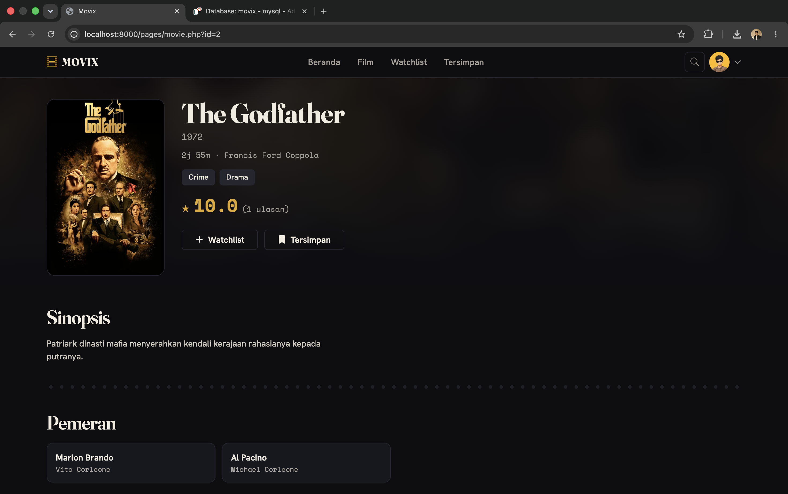
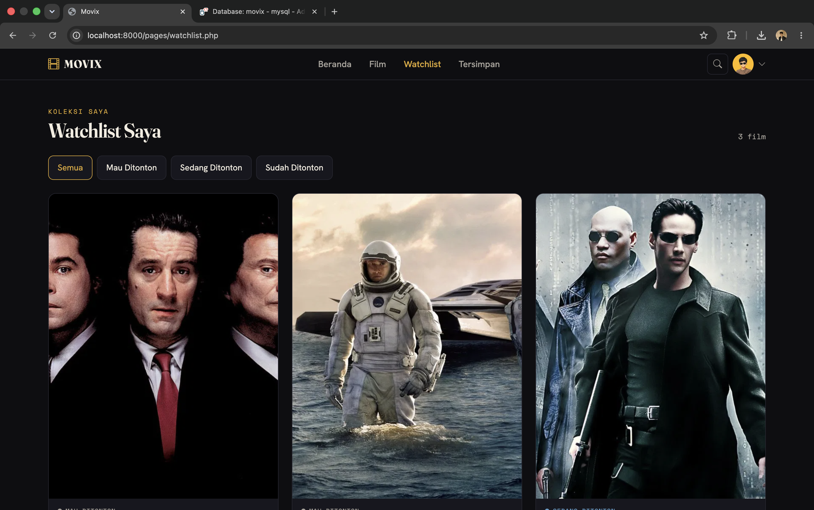
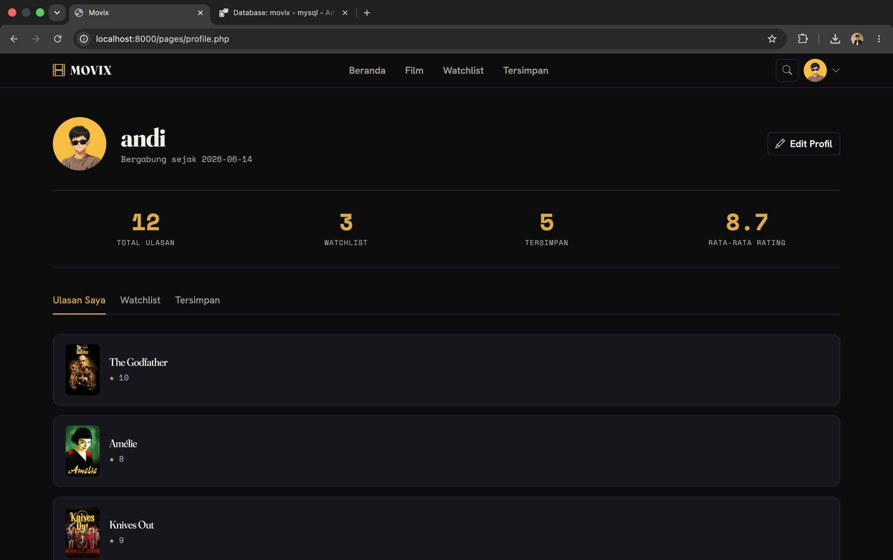

# Movix: Your Gateway to the World of Movies

Platform katalog film bertema sinematik gelap, tempat pengguna dapat menjelajahi film, menulis ulasan, menyusun watchlist, dan menyimpan film favorit.

- **Nama:** Nyoman Dimas W B
- **NIM:** 25/561741/SV/26643

## Tampilan

| Beranda                                     | Daftar Film                                         |
| ------------------------------------------- | --------------------------------------------------- |
|  |  |

| Detail Film                                         | Watchlist                                       |
| --------------------------------------------------- | ----------------------------------------------- |
|  |  |

| Profil                                    |
| ----------------------------------------- |
|  |

## Fitur Utama

- Autentikasi pengguna (registrasi, login, logout) dengan hashing kata sandi.
- Katalog film dengan pencarian, filter genre, pengurutan, dan pagination.
- Halaman detail film dengan sinopsis, pemeran, dan ulasan.
- **CRUD ulasan**: tulis, edit, dan hapus ulasan beserta rating 1-10.
- **CRUD watchlist**: tambah film, ubah status (Mau Ditonton / Sedang Ditonton / Sudah Ditonton), dan hapus.
- **CRUD film tersimpan**: simpan dan hapus film favorit.
- Halaman profil dengan statistik aktivitas dan edit profil (termasuk unggah foto profil).
- Antarmuka responsif (375px hingga 1440px) dengan tema gelap sinematik.

## Teknologi

- **Backend:** PHP 8.x (PDO, prepared statements)
- **Database:** MySQL 8.4 (dijalankan via Docker)
- **Frontend:** Bootstrap 5 (dilokalkan, tanpa CDN), JavaScript vanilla
- **Font & ikon:** dilokalkan sepenuhnya di `assets/css/fonts/`

## Struktur Proyek

```
movix/
├── assets/
│   ├── css/         # bootstrap, tokens, components, pages, + folder fonts/
│   ├── js/          # bootstrap bundle + main.js
│   └── img/avatars/ # foto profil yang diunggah pengguna
├── database/
│   ├── schema.sql   # struktur tabel, view, function, trigger
│   ├── seed.sql     # data awal
│   └── queries.sql  # kumpulan query kompleks
├── docs/
│   └── screenshots/ # tangkapan layar untuk README
├── includes/
│   ├── config.php   # koneksi database & env
│   ├── init.php     # pintu masuk tunggal (memuat config + helpers)
│   ├── helpers/     # functions.php, avatar.php
│   └── partials/    # header, footer, auth_header, auth_footer
├── pages/           # auth pages, movies, watchlis, profile, etc.
├── index.php        # halaman beranda
├── router.php       # router untuk server bawaan PHP (dev)
├── compose.yml      # konfigurasi Docker MySQL + Adminer
└── .env.example     # contoh konfigurasi environment
```

## Cara Menjalankan (Lokal)

### Prasyarat

- PHP 8.x terpasang
- Docker dan Docker Compose

### Langkah

1. **Klon repositori dan masuk ke foldernya.**

   ```bash
   git clone <url-repositori>
   cd movix
   ```

2. **Siapkan environment.** Salin `.env.example` menjadi `.env`, lalu sesuaikan bila perlu.

   ```bash
   cp .env.example .env
   ```

3. **Jalankan database lewat Docker.** MySQL berjalan di port `3307`, dan Adminer (GUI database) di port `8082`.

   ```bash
   docker compose up -d
   ```

4. **Impor struktur dan data.** Buka Adminer di `http://localhost:8082`, lalu jalankan isi `database/schema.sql` kemudian `database/seed.sql`.

5. **Jalankan server PHP.**

   ```bash
   php -S localhost:8000 router.php
   ```

6. **Buka aplikasi** di `http://localhost:8000`.

### Akun Demo

Tersedia akun bawaan dari seed (kata sandi semuanya `password123`):

| Email             | Username |
| ----------------- | -------- |
| andi@example.com  | andi     |
| bella@example.com | bella    |
| citra@example.com | citra    |

## Pemenuhan Rubrik PPW 1

- **CRUD ke MySQL:** ulasan, watchlist, dan film tersimpan (create, read, update, delete).
- **Responsif:** layout diuji pada rentang 375px hingga 1440px memakai Bootstrap.
- **Validasi JavaScript:** validasi sisi klien pada form registrasi (username, email, kata sandi) dan form ulasan (rating, teks), dengan `confirm()` sebelum setiap penghapusan.
- **Keamanan PHP:** `password_hash`/`password_verify`, sesi dengan `session_regenerate_id`, seluruh output di-escape dengan `htmlspecialchars`, dan seluruh query memakai prepared statement.
- **Konfigurasi terpisah:** kredensial database disimpan di `.env` (tidak di-hardcode), dan diblokir dari akses publik lewat `router.php`.
- **Komponen Bootstrap:** Navbar, Card, Dropdown, Collapse, dan Alert.

## Ringkasan Basis Data

Database `movix` terdiri dari **9 tabel**: `users`, `movies`, `genres`, `movie_genres`, `actors`, `movie_actors`, `reviews`, `watchlist`, dan `saved_movies`.

Komponen lanjutan:

- **3 View:** `view_movie_ratings` (film + genre + statistik rating), `view_user_activity` (ringkasan aktivitas pengguna), `view_top_rated_movies` (film dengan minimal 2 ulasan).
- **3 Function:** `fn_movie_avg_rating`, `fn_user_review_count`, `fn_rating_label`.
- **4 Trigger:** tiga trigger pada `reviews` (after insert/update/delete) yang otomatis menyegarkan kolom cache `avg_rating` dan `review_count` di tabel `movies`, serta satu trigger `before insert` pada `users` untuk menormalkan email.

Kueri kompleks (JOIN multi-tabel, subquery, agregasi `GROUP BY`/`HAVING`, dan window function) tersedia di `database/queries.sql`.

## Kredit Font

Font yang digunakan bersifat open-source (SIL Open Font License) dan disertakan secara lokal di `assets/css/fonts/`:

- **Fraunces:** display/judul
- **Hanken Grotesk:** teks/antarmuka
- **Space Mono:** metadata/rating

## Lisensi

Proyek ini dibuat untuk memenuhi Ujian Akhir Semester Mata Kuliah Praktikum Pemrograman Web 1.
